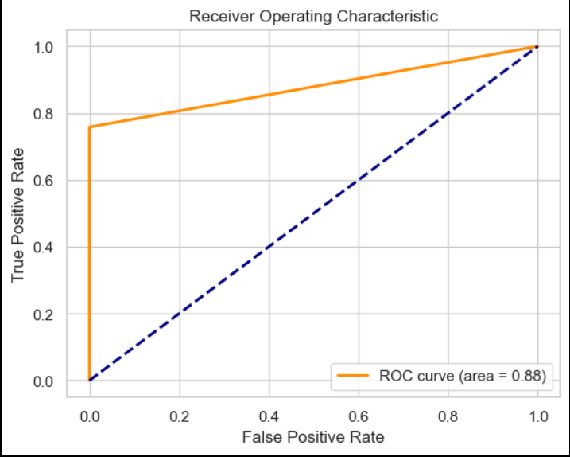

# 📌 Project Overview
This project focuses on detecting fraudulent transactions using machine learning algorithms. Fraudulent financial activities are a major concern for digital platforms and banks. By leveraging classification models, this project aims to predict and prevent suspicious transactions before they can cause damage.

# 🚀 Features
Exploratory Data Analysis (EDA)

Data Preprocessing and Feature Engineering

Machine Learning Pipelines using:
Random Forest

XGBoost

Model Evaluation (Accuracy, Confusion Matrix, ROC-AUC, etc.)

Interactive Web App using Streamlit for real-time prediction

# 🛠️ Tech Stack
Python (Pandas, NumPy, Matplotlib, Seaborn)

Scikit-learn

XGBoost

Streamlit

Jupyter Notebook 

# 📂 Dataset
The dataset includes real-time financial transaction data labeled as fraudulent or legitimate. It contains transaction details such as:

Amount

Origin/Destination balances

Transaction type (e.g., TRANSFER, CASH_OUT,etc)

Time and account IDs (masked)

Note: The dataset has been anonymized to preserve user privacy.

# 🧠 Model Training
Multiple models were trained and evaluated. Hyperparameter tuning and cross-validation were used to enhance performance. The best-performing model was integrated into a Streamlit app for testing.

# 📈 Results
Accuracy: ~95% (varies by model)

ROC-AUC: ~0.88

Feature Importance: Transaction amount and balance difference were key predictors

# 🖥️ Streamlit App
An interactive web interface was created using Streamlit. Users can input transaction details and the model will predict whether the transaction is fraudulent or legitimate.

streamlit run Fraud_detection.py

🧪 Test Cases
The project includes a set of test inputs to evaluate the model. These help verify model performance under various scenarios.

🙋‍♂️ Author
Pranab Bhardwaj
[🔗 LinkedIn](https://www.linkedin.com/in/pranab-bhardwaj29/) | 📫 pranabbhardwaj29@gmail.com

